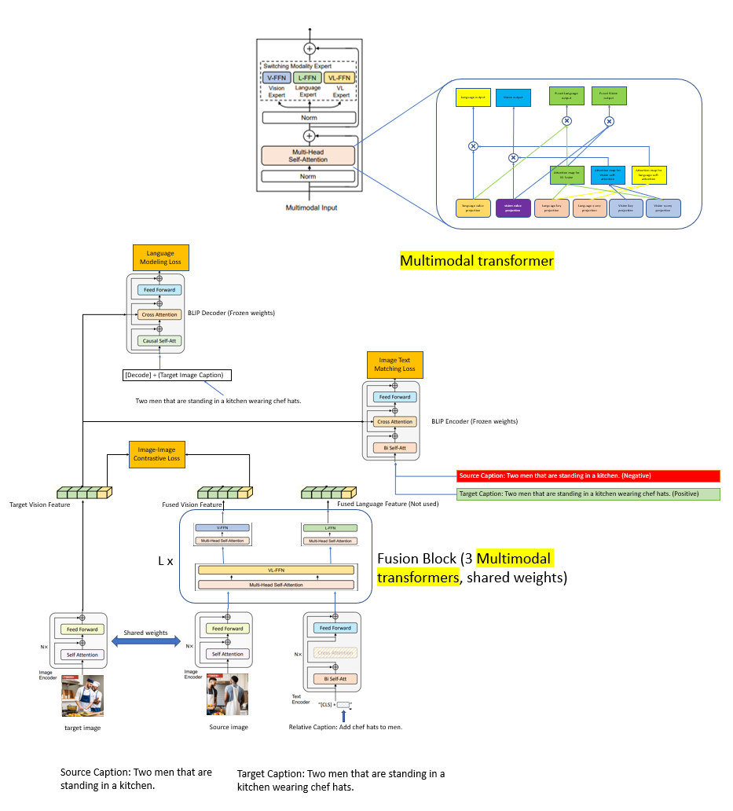

Our aim is to adapt BLIP to solve Image Retrieval Task, specifically for fashion domain.
We added datasets such as Fashion200k, FashionIQ, CIRR.
We also proposed a new architecture as shown below:


## Data preparation


```
project_base_path

└───  cirr_dataset
       └─── train
            └─── 0
                | train-10108-0-img0.png
                | train-10108-0-img1.png
                | train-10108-1-img0.png
                | ...

            └─── 1
                | train-10056-0-img0.png
                | train-10056-0-img1.png
                | train-10056-1-img0.png
                | ...

            ...

       └─── dev
            | dev-0-0-img0.png
            | dev-0-0-img1.png
            | dev-0-1-img0.png
            | ...

       └─── test1
            | test1-0-0-img0.png
            | test1-0-0-img1.png
            | test1-0-1-img0.png
            | ...

       └─── cirr
            └─── captions
                | cap.rc2.test1.json
                | cap.rc2.train.json
                | cap.rc2.val.json

            └─── image_splits
                | split.rc2.test1.json
                | split.rc2.train.json
                | split.rc2.val.json


```

### Preparing CIRR

1. Clone CIRR dataset `git clone -b cirr_dataset https://github.com/Cuberick-Orion/CIRR.git cirr`
2. Raw images from `https://lil.nlp.cornell.edu/resources/NLVR2/`

### Preparing Fashion200k

The instructions to download Fashion 200k can be found [here](https://github.com/xthan/fashion-200k)

For the generated test_queries.txt, we use the one generated by the authors of [TIRG paper](https://github.com/google/tirg) which can be found [here](https://storage.googleapis.com/image_retrieval_css/test_queries.txt). 

The fashion-200k directory should follow the following structure and have these files.

```
/fashion-200k/labels/*.txt
/fashion-200k/women/<category>/<caption>/<id>/*.jpeg
/fashion-200k/test_queries.txt`
```